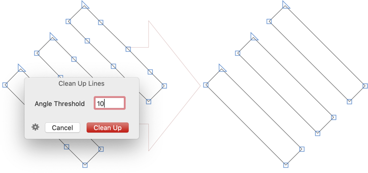

# CleanUpLines

[Glyphs.app](https://www.glyphsapp.com/) filter for cleaning up unnecessary line segments. After installation, it will add a *Filter* menu item called *Clean Up Lines* (de: *Linien aufräumen,* fr: *Nettoyer les lignes,* es: *Limpiar líneas,* pt: *Limpar linhas,* jp: ラインをクリーンアップ, ko: 라인 정리, zh: 清理线路).
It will remove all (blue) on-curve points between two line segments if the two segments form an angle less than the given threshold.

### Installation

1. One-click install *Clean Up Lines* from *Window > Plugin Manager > Plugins.*
2. Restart Glyphs.

### Usage Instructions

1. Open a glyph in Edit View.
2. Choose *Filter > Clean Up Lines.*
3. In the window, pick a threshold angle, use (Shift) up/down arrows for adjusting the threshold value incrementally.
4. Click *Clean Up.*

### License

Copyright 2021 Rainer Erich Scheichelbauer (@mekkablue).
Based on sample code by Georg Seifert (@schriftgestalt) and Jan Gerner (@yanone).

Licensed under the Apache License, Version 2.0 (the "License");
you may not use this file except in compliance with the License.
You may obtain a copy of the License at

http://www.apache.org/licenses/LICENSE-2.0

See the License file included in this repository for further details.
